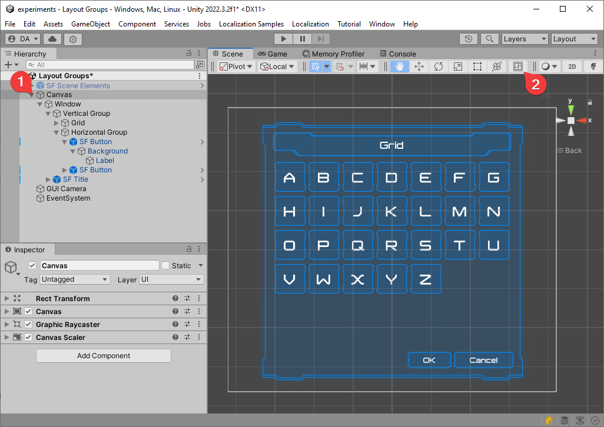
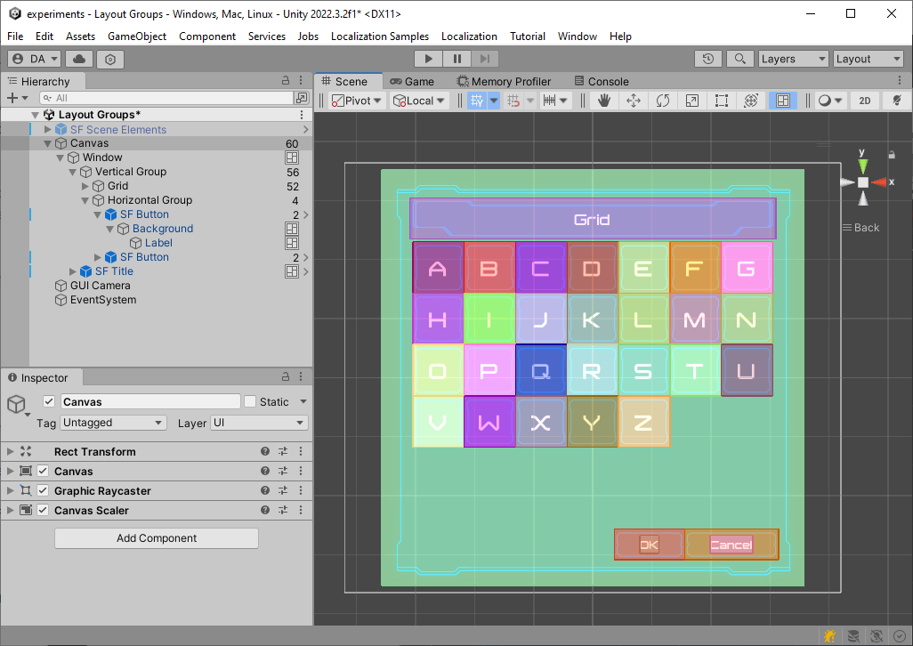
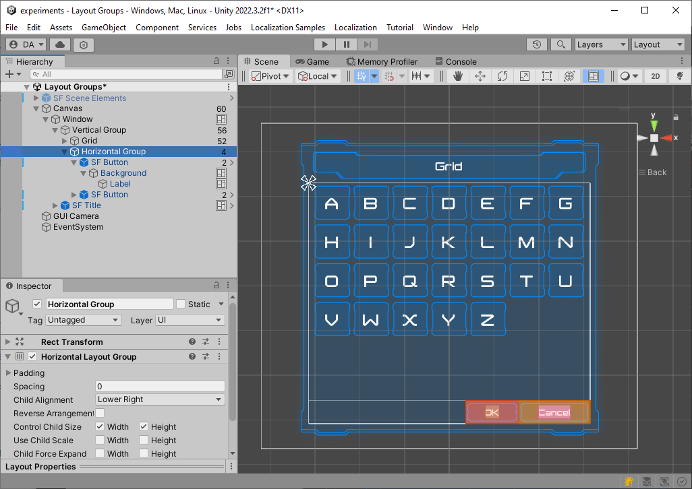
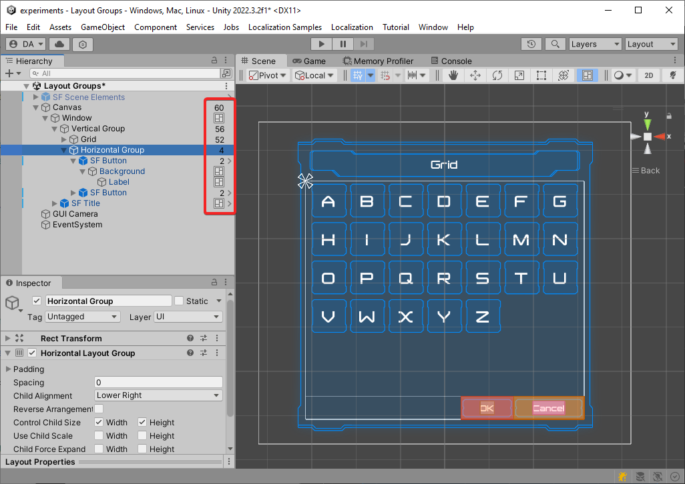

# Raycast target visualization tool

Every unnecessary enabled raycast target reduce performance. This tool displays all enabled raycast targets, allowing better control over Canvas component settings

## Installation into Unity project

You can install the Raycast target visualization tool via the Unity Package Manager using the following link https://github.com/antonovdv/raycast-target-visualization-tool.git#1.1.0

## How to use

1. Select any element in the hierarchy
2. An icon will appear on the toolbar that allows you to activate the mode for displaying enabled raycast targets

3. In the Scene, only the elements that are children of the selected one in the hierarchy will be highlighted. By selecting different elements in the hierarchy, you can narrow down the search radius

4. In the hierarchy, there is a number displayed indicating the count of nested raycast target for each element, along with an icon indicating whether the object has raycast target enabled

